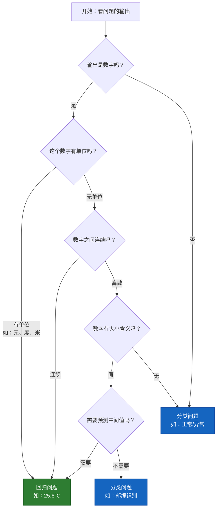

# 如何区分分类问题和回归问题

---

## 一、核心区别

### 1.1 一句话区别

```
分类问题（Classification）
→ 预测离散的类别标签
→ 输出：有限个类别（如：猫、狗、鸟）

回归问题（Regression）
→ 预测连续的数值
→ 输出：实数范围（如：25.6°C、¥1,234,567）
```

### 1.2 本质差异

```
          分类                    回归
          ↓                       ↓
    离散的类别              连续的数值
          ↓                       ↓
    有限个选项              无限个可能
          ↓                       ↓
   画分界线                  拟合曲线
```

---

## 二、详细对比表

### 2.1 核心维度对比

| 维度 | 分类问题 | 回归问题 |
|------|---------|---------|
| **输出类型** | 离散类别 | 连续数值 |
| **输出范围** | 有限个类别 | 实数域 (-∞, +∞) |
| **数学表达** | y ∈ {C₁, C₂, ..., Cₙ} | y ∈ ℝ |
| **目标** | 找到决策边界 | 找到拟合函数 |
| **预测结果** | 类别标签 | 具体数值 |
| **可否排序** | 不可排序 | 可以排序 |
| **精确度要求** | 精确匹配类别 | 接近真实值即可 |

### 2.2 技术细节对比

| 维度 | 分类问题 | 回归问题 |
|------|---------|---------|
| **损失函数** | 交叉熵、Hinge Loss | MSE、MAE、Huber Loss |
| **评估指标** | 准确率、精确率、召回率、F1 | MSE、RMSE、MAE、R² |
| **输出层激活** | Softmax、Sigmoid | 线性激活 |
| **典型算法** | 逻辑回归、SVM、决策树分类 | 线性回归、决策树回归 |
| **可视化** | 混淆矩阵 | 残差图、散点图 |

---

## 三、判断方法

### 3.1 五步判断法

```
Step 1: 看输出类型
问：输出是类别还是数值？

Step 2: 看输出范围
问：输出有多少种可能？

Step 3: 看能否排序
问：输出之间有大小关系吗？

Step 4: 看精确度要求
问：需要精确值还是大概范围？

Step 5: 看业务含义
问：业务上需要的是分类还是数值？
```

### 3.2 快速判断技巧

```
✅ 是分类问题的信号：

关键词：
- "判断是否..."
- "识别..."
- "分为几类..."
- "属于哪个类别..."
- "是/否"
- "类型"

输出特征：
- 可以用文字描述（正常/异常）
- 有限个选项
- 互斥的类别

✅ 是回归问题的信号：

关键词：
- "预测多少..."
- "估计..."
- "计算..."
- "有多高/多低..."
- 带单位（元、度、米）

输出特征：
- 数字表达（25.6°C）
- 无限可能
- 可以比较大小
```

---

## 四、典型案例对比

### 4.1 生活场景示例

#### 分类问题示例

```
1️⃣ 垃圾邮件检测
   输入：邮件内容
   输出：垃圾邮件 / 正常邮件（2个类别）
   ✅ 分类问题

2️⃣ 图像识别
   输入：动物图片
   输出：猫 / 狗 / 鸟（N个类别）
   ✅ 分类问题

3️⃣ 疾病诊断
   输入：患者症状和检查结果
   输出：健康 / 感冒 / 肺炎 / 其他（类别）
   ✅ 分类问题

4️⃣ 情感分析
   输入：评论文本
   输出：正面 / 负面 / 中性（3个类别）
   ✅ 分类问题

5️⃣ 手写数字识别
   输入：手写数字图片
   输出：0-9（10个类别）
   ✅ 分类问题
```

#### 回归问题示例

```
1️⃣ 房价预测
   输入：房屋特征（面积、地段等）
   输出：¥3,500,000（连续数值）
   ✅ 回归问题

2️⃣ 温度预测
   输入：历史气象数据
   输出：25.6°C（连续数值）
   ✅ 回归问题

3️⃣ 销售额预测
   输入：历史销售、促销等
   输出：¥1,234,567（连续数值）
   ✅ 回归问题

4️⃣ 股票价格预测
   输入：历史价格、成交量等
   输出：¥52.35（连续数值）
   ✅ 回归问题

5️⃣ 年龄预测
   输入：人脸图片
   输出：28.5岁（连续数值）
   ✅ 回归问题
```

---

## 五、易混淆的案例

### 5.1 看起来是数字，但其实是分类

```
案例1：邮政编码识别
输入：手写邮编图片
输出：100000, 200000, 310000...

❓ 是回归还是分类？

✅ 答案：分类问题

原因：
- 邮编虽然是数字，但代表离散的区域
- 不存在"中间值"（没有100500这个邮编）
- 邮编之间没有大小关系
- 100000和200000之间不连续

案例2：年级识别
输入：学生信息
输出：1年级、2年级、3年级...

❓ 是回归还是分类？

✅ 答案：分类问题（但可以用序数回归）

原因：
- 虽然有数字，但是离散的等级
- 只有有限个年级
- 虽然有顺序，但间隔不均匀

案例3：评分（1-5星）
输入：商品评论
输出：1星、2星、3星、4星、5星

❓ 是回归还是分类？

✅ 答案：可以两者都是（取决于建模方式）

分类视角：
- 5个离散类别
- 互斥的选择

回归视角：
- 连续的评分尺度
- 可以用回归后四舍五入

实践中：
- 数据量小：分类
- 需要考虑顺序：序数回归
- 需要中间值：回归
```

### 5.2 看起来是分类，但可以转为回归

```
案例1：疾病严重程度
输入：患者检查结果
输出：轻度 / 中度 / 重度

❓ 分类还是回归？

方法1：作为分类（多分类）
→ 3个类别

方法2：作为回归
→ 轻度=1, 中度=2, 重度=3
→ 预测连续值，再转换为等级

选择依据：
- 如果等级划分明确 → 分类
- 如果需要细粒度评估 → 回归
```

---

## 六、判断流程图

### 6.1 完整决策树



### 6.2 简化判断流程

```
问题1：输出是类别标签吗？
   ├─ 是 → 分类问题
   └─ 否 → 继续

问题2：输出是连续数值吗？
   ├─ 是 → 回归问题
   └─ 否 → 继续

问题3：输出是有限个选项吗？
   ├─ 是 → 分类问题
   └─ 否 → 回归问题
```

---

## 七、实战检验

### 7.1 练习题

```
判断下列问题是分类还是回归：

1. 预测明天是否下雨
   答案：________

2. 预测明天的降雨量（毫米）
   答案：________

3. 识别交通标志
   答案：________

4. 预测汽车速度
   答案：________

5. 判断肿瘤良性/恶性
   答案：________

6. 预测肿瘤大小（厘米）
   答案：________

7. 识别语音中的单词
   答案：________

8. 预测股票涨跌
   答案：________

9. 预测股票涨跌幅度（%）
   答案：________

10. 推荐电影类型
    答案：________

11. 预测电影评分（0-10分）
    答案：________

12. 预测用户点击概率
    答案：________
```

### 7.2 答案与解析

```
1. 分类问题
   → 输出：下雨/不下雨（2个类别）

2. 回归问题
   → 输出：具体降雨量（连续值）

3. 分类问题
   → 输出：禁止、停止、限速等（N个类别）

4. 回归问题
   → 输出：80.5 km/h（连续值）

5. 分类问题
   → 输出：良性/恶性（2个类别）

6. 回归问题
   → 输出：3.2 cm（连续值）

7. 分类问题
   → 输出：单词类别（有限词汇）

8. 分类问题
   → 输出：涨/跌（2个类别）

9. 回归问题
   → 输出：+3.5%（连续值）

10. 分类问题
    → 输出：动作/喜剧/恐怖等（类别）

11. 回归问题（或序数回归）
    → 输出：7.8分（连续值）

12. 回归问题
    → 输出：0.23（连续概率值）
```

---

## 八、特殊情况处理

### 8.1 二元分类 vs 回归

```
场景：预测用户是否点击广告

方法1：作为分类问题
输出：点击 / 不点击
模型：逻辑回归、SVM
评估：准确率、F1分数

方法2：作为回归问题
输出：点击概率（0-1之间）
模型：线性回归（需要约束到0-1）
评估：MSE

选择建议：
✅ 如果只需要判断是否 → 分类
✅ 如果需要概率值 → 回归
✅ 实践中：逻辑回归输出概率 → 两者结合
```

### 8.2 多分类 vs 多输出回归

```
场景：同时预测多个相关值

例子：预测用户行为

方法1：多分类
输出：购买/加购/浏览/离开（1个类别）
特点：互斥的选择

方法2：多输出回归
输出：[购买概率, 加购概率, 浏览时长, 停留时长]
特点：多个连续值

区别：
分类 → 选一个类别
回归 → 预测多个数值
```

### 8.3 序数问题（Ordinal）

```
定义：
类别之间有顺序关系，但间隔不一定均匀

例子：
- 教育程度：小学 < 初中 < 高中 < 大学
- 疾病严重度：轻度 < 中度 < 重度
- 满意度：非常不满意 < 不满意 < 一般 < 满意 < 非常满意

处理方式：

方法1：普通多分类
→ 忽略顺序关系

方法2：序数回归（Ordinal Regression）
→ 专门的算法考虑顺序

方法3：转为回归
→ 编码为数字后用回归

选择建议：
- 类别少、数据多 → 多分类
- 需要考虑顺序 → 序数回归
- 类别多、间隔较均匀 → 回归
```

---

## 九、从问题到方案

### 9.1 问题转换示例

#### 案例1：房价问题

```
原始问题：
"帮我分析这个房子值多少钱"

分析：
输出：具体房价（如¥3,500,000）
类型：连续数值
判断：✅ 回归问题

技术方案：
- 算法：线性回归、随机森林回归、XGBoost
- 特征：面积、地段、楼层、装修等
- 评估：RMSE、R²
```

#### 案例2：垃圾邮件检测

```
原始问题：
"判断这封邮件是不是垃圾邮件"

分析：
输出：垃圾邮件 / 正常邮件
类型：离散类别（2个）
判断：✅ 分类问题（二分类）

技术方案：
- 算法：逻辑回归、朴素贝叶斯、SVM
- 特征：关键词、发件人、链接数等
- 评估：准确率、精确率、召回率
```

#### 案例3：信用评分

```
原始问题：
"给用户一个信用分（300-850分）"

分析：
输出：具体分数
类型：连续数值（虽然有范围）
判断：✅ 回归问题

技术方案：
- 算法：线性回归、梯度提升树
- 特征：收入、负债、信用历史等
- 评估：MAE、RMSE
- 后处理：裁剪到300-850范围
```

---

## 十、常见错误

### 10.1 误将回归当作分类

```
❌ 错误案例：

问题：预测房价
错误做法：
- 将房价分为：低价(<100万)、中价(100-300万)、高价(>300万)
- 作为三分类问题

问题：
1. 损失了信息（100万和99万被认为是不同类）
2. 分界点人为定义，不合理
3. 无法给出精确预测

✅ 正确做法：
直接作为回归问题预测具体房价
```

### 10.2 误将分类当作回归

```
❌ 错误案例：

问题：预测用户会购买哪类商品
错误做法：
- 给商品类别编号：电子产品=1, 服装=2, 食品=3
- 作为回归问题，预测数字

问题：
1. 类别之间没有大小关系
2. 预测2.5没有意义
3. 模型会学到错误的模式

✅ 正确做法：
作为多分类问题，直接预测类别
```

---

## 十一、总结

### 核心判断标准

```
看输出类型：
┌──────────────┬──────────────┐
│  离散类别    │  连续数值    │
│      ↓       │      ↓       │
│  分类问题    │  回归问题    │
└──────────────┴──────────────┘

看输出范围：
┌──────────────┬──────────────┐
│  有限个选项  │  无限可能    │
│      ↓       │      ↓       │
│  分类问题    │  回归问题    │
└──────────────┴──────────────┘

看能否排序：
┌──────────────┬──────────────┐
│  不可比较    │  可以比较    │
│      ↓       │      ↓       │
│  分类问题    │  回归问题    │
└──────────────┴──────────────┘
```

### 记忆口诀

```
分类离散类别选
回归连续数值算
看到"是否"想分类
看到单位想回归
```

### 快速检查清单

```
✅ 确认是分类问题，如果：
□ 输出是类别标签（文字或编号）
□ 只有有限个可能的输出
□ 输出之间没有大小关系
□ 需要"判断"、"识别"、"分类"

✅ 确认是回归问题，如果：
□ 输出是具体数值
□ 输出有单位（元、度、米）
□ 可以无限细分
□ 需要"预测"、"估计"、"计算"
```

---

## 十二、实用建议

### 12.1 遇到模糊情况

```
如果不确定是分类还是回归：

1. 优先考虑业务需求
   → 业务需要的是类别还是数值？

2. 看数据标注方式
   → 数据是如何标注的？

3. 尝试两种建模
   → 比较哪种效果更好

4. 咨询领域专家
   → 听取专业意见
```

### 12.2 两者结合

```
某些场景可以结合使用：

例子：疾病诊断
- 分类：判断疾病类型（分类问题）
- 回归：预测病情严重度（回归问题）

例子：广告推荐
- 分类：预测是否点击（分类问题）
- 回归：预测点击概率（回归问题）
- 回归：预测转化价值（回归问题）

技巧：
可以用回归输出概率，再用阈值转为分类
```

---

## 一句话总结

> **区分分类和回归的核心在于看输出：离散的类别标签 → 分类问题；连续的数值 → 回归问题。当遇到数字输出时，要判断这个数字是代表类别还是真正的数值，关键看是否连续、是否有单位、是否可以无限细分。**
