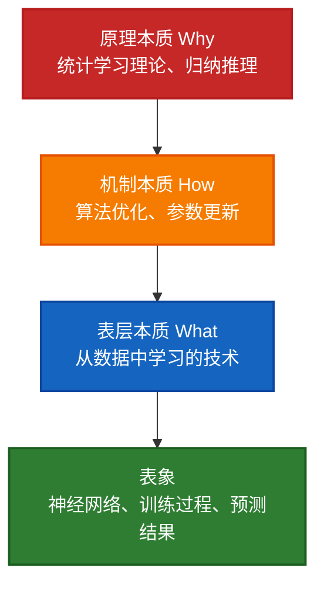

# 本质的划分维度

理解"本质"可以从多个维度来划分和分析。不同的划分方式帮助我们更全面、更深入地认识事物。

---

## 目录
- [一、按认识层次划分](#一按认识层次划分)
- [二、按学科视角划分](#二按学科视角划分)
- [三、按抽象程度划分](#三按抽象程度划分)
- [四、按时间维度划分](#四按时间维度划分)
- [五、按存在方式划分](#五按存在方式划分)
- [六、按稳定性划分](#六按稳定性划分)
- [七、按认识主体划分](#七按认识主体划分)
- [八、按复杂程度划分](#八按复杂程度划分)
- [九、在机器学习中的应用](#九在机器学习中的应用)
- [十、如何选择合适的划分维度](#十如何选择合适的划分维度)
- [十一、总结](#十一总结)

---

## 一、按认识层次划分

### 1.1 表层本质（What - 是什么）
**定义**：事物的直接定义和基本属性

```
例子：机器学习

表层本质：
✅ 机器学习是一种让计算机从数据中自动学习的技术
✅ 机器学习是人工智能的一个分支

特点：
- 回答"是什么"
- 直接、明确
- 容易理解
```

### 1.2 机制本质（How - 怎么做）
**定义**：事物运作的内在机制和原理

```
例子：机器学习

机制本质：
✅ 通过算法（如梯度下降）优化模型参数
✅ 最小化损失函数
✅ 从训练数据中学习映射关系 f: X → Y

特点：
- 回答"如何运作"
- 涉及过程和方法
- 需要专业知识
```

### 1.3 原理本质（Why - 为什么）
**定义**：事物存在和有效的根本原因

```
例子：机器学习

原理本质：
✅ 基于统计学习理论
✅ 假设数据中存在规律（模式）
✅ 训练数据的分布能代表总体分布
✅ 基于归纳推理（从特殊到一般）

特点：
- 回答"为什么有效"
- 最深层的认识
- 涉及理论基础
```

### 层次关系图



---

## 二、按学科视角划分

### 2.1 哲学本质
**关注**：事物的根本属性和存在意义

```
例子：人的本质

哲学视角：
✅ 理性动物（亚里士多德）
✅ 社会关系的总和（马克思）
✅ 存在先于本质（萨特）
✅ 有自我意识的主体

特点：最抽象、最根本
```

### 2.2 科学本质
**关注**：客观规律和可验证的因果关系

```
例子：人的本质

科学视角：
✅ 生物学：智人（Homo sapiens）
✅ 遗传学：特定的DNA序列
✅ 神经科学：复杂的神经系统
✅ 进化论：进化的产物

特点：可测量、可验证
```

### 2.3 社会本质
**关注**：社会功能和角色

```
例子：金钱的本质

社会视角：
✅ 交换媒介
✅ 价值尺度
✅ 支付手段
✅ 社会权力的象征

特点：强调社会关系和功能
```

### 2.4 心理本质
**关注**：主观体验和心理机制

```
例子：爱情的本质

心理视角：
✅ 依恋理论：情感依恋
✅ 需求理论：满足亲密需求
✅ 认知理论：特殊的心理表征

特点：关注主观感受
```

### 2.5 技术本质
**关注**：功能实现和操作方法

```
例子：互联网的本质

技术视角：
✅ TCP/IP协议
✅ 分布式网络架构
✅ 数据包交换技术

特点：可操作、可实现
```

---

## 三、按抽象程度划分

### 3.1 具体本质（个别性）
**定义**：特定事物独有的本质属性

```
例子：

苹果iPhone的本质：
✅ 苹果公司设计的智能手机
✅ iOS操作系统
✅ 封闭的生态系统

特点：针对特定对象
```

### 3.2 类别本质（一般性）
**定义**：同类事物共同的本质属性

```
例子：

智能手机的本质：
✅ 具有移动操作系统
✅ 触摸屏交互
✅ 集成多种传感器
✅ 可安装应用程序

特点：适用于一类事物
```

### 3.3 抽象本质（普遍性）
**定义**：更高层次的普遍规律

```
例子：

计算设备的本质：
✅ 信息处理工具
✅ 输入-处理-输出模型
✅ 扩展人类认知能力

特点：最抽象、最普遍
```

### 抽象层次图

```
普遍本质：计算设备
    ↑
    | 更抽象
    |
类别本质：智能手机
    ↑
    | 
    |
具体本质：iPhone 15
```

---

## 四、按时间维度划分

### 4.1 历史本质（起源）
**关注**：事物最初形成的本质

```
例子：语言的本质

历史视角：
✅ 起源：人类沟通交流的需要
✅ 最初功能：传递信息、协调行动
✅ 演化：从简单手势到复杂语法

问：语言最初为什么产生？
```

### 4.2 现实本质（当下）
**关注**：事物当前的核心属性

```
例子：语言的本质

现实视角：
✅ 符号系统
✅ 表达思想的工具
✅ 文化载体
✅ 社会交往媒介

问：语言现在是什么？
```

### 4.3 发展本质（趋势）
**关注**：事物发展的内在规律

```
例子：语言的本质

发展视角：
✅ 从口语到文字
✅ 从单一到多样
✅ 从自然语言到编程语言
✅ 未来：人机交互语言

问：语言将走向何方？
```

---

## 五、按存在方式划分

### 5.1 物质本质
**定义**：物理存在和物质构成

```
例子：计算机

物质本质：
✅ 由硅、金属、塑料等材料构成
✅ 基于半导体物理原理
✅ 电子信号的物理传输

特点：有形的、可触摸的
```

### 5.2 功能本质
**定义**：作用和功能

```
例子：计算机

功能本质：
✅ 信息处理工具
✅ 执行算法的机器
✅ 数据存储与计算

特点：强调"做什么"
```

### 5.3 关系本质
**定义**：与其他事物的关系

```
例子：计算机

关系本质：
✅ 人机交互的接口
✅ 网络节点
✅ 信息社会的基础设施

特点：存在于关系之中
```

### 5.4 意义本质
**定义**：对人类的意义和价值

```
例子：计算机

意义本质：
✅ 扩展人类智力的工具
✅ 改变工作和生活方式
✅ 推动社会进步

特点：强调价值和意义
```

---

## 六、按稳定性划分

### 6.1 不变本质（恒定性）
**定义**：始终不变的核心属性

```
例子：三角形

不变本质：
✅ 三条边
✅ 三个角
✅ 内角和180°

特点：
- 定义性质
- 绝对稳定
- 不会改变
```

### 6.2 相对本质（可变性）
**定义**：在一定范围内稳定，但可能改变

```
例子：企业

相对本质：
✅ 当前：盈利组织
✅ 可能变化：非盈利转型
✅ 某个时期：社会责任主体

特点：
- 阶段性质
- 相对稳定
- 可能演变
```

### 6.3 发展本质（演化性）
**定义**：在发展中不断变化的本质

```
例子：生命

发展本质：
✅ 单细胞 → 多细胞
✅ 简单 → 复杂
✅ 适应环境的能力不断增强

特点：
- 动态变化
- 持续演进
```

---

## 七、按认识主体划分

### 7.1 客观本质
**定义**：不依赖人的意识而存在的本质

```
例子：万有引力

客观本质：
✅ 质量之间的相互吸引
✅ F = G(m₁m₂)/r²
✅ 无论人类是否认识，都存在

特点：
- 独立于认识
- 客观存在
- 可以被发现
```

### 7.2 主观本质
**定义**：依赖人的认识和定义的本质

```
例子：艺术

主观本质：
✅ 对美的表达和追求
✅ 情感的抒发
✅ 不同文化有不同理解

特点：
- 依赖认识主体
- 有主观性
- 文化相对性
```

### 7.3 社会本质
**定义**：由社会共识决定的本质

```
例子：货币

社会本质：
✅ 交换媒介（社会共识）
✅ 价值是社会赋予的
✅ 脱离社会就失去意义

特点：
- 社会构建
- 共识决定
- 约定俗成
```

---

## 八、按复杂程度划分

### 8.1 简单本质（单一性）
**定义**：由单一属性或简单关系构成

```
例子：盐（化学）

简单本质：
✅ 化学式：NaCl
✅ 钠离子和氯离子的离子键化合物

特点：
- 单一、明确
- 易于理解
- 清晰定义
```

### 8.2 复杂本质（多元性）
**定义**：由多个要素和关系构成

```
例子：生态系统

复杂本质：
✅ 生物与环境的相互作用
✅ 能量流动
✅ 物质循环
✅ 信息传递
✅ 自组织和动态平衡

特点：
- 多要素
- 相互作用
- 涌现性质
```

### 8.3 涌现本质（整体性）
**定义**：整体大于部分之和的本质

```
例子：意识

涌现本质：
✅ 不是单个神经元的属性
✅ 是神经网络整体的涌现现象
✅ 无法从单个部分推导出来

特点：
- 整体性
- 不可还原
- 质的飞跃
```

---

## 九、在机器学习中的应用

### 综合维度分析机器学习的本质

#### 1. 按认识层次划分

| 层次 | 机器学习的本质 | 应用场景 |
|------|---------------|---------|
| **表层本质** | 从数据中学习的技术 | 向普通人介绍机器学习 |
| **机制本质** | 通过算法优化参数，最小化损失函数 | 工程师实现机器学习系统 |
| **原理本质** | 基于统计学习理论的归纳推理 | 研究者理论创新 |

#### 2. 按学科视角划分

##### 数学本质
```
✅ 函数逼近问题
   目标：找到函数 f，使得 f(x) ≈ y
   
✅ 优化问题
   目标：min L(θ) = Σ loss(f(x;θ), y)
   
✅ 概率推断
   目标：P(y|x) 的估计
```

##### 计算机科学本质
```
✅ 算法设计
   梯度下降、反向传播等算法
   
✅ 数据结构
   张量、矩阵运算
   
✅ 计算复杂度
   时间复杂度、空间复杂度权衡
```

##### 统计学本质
```
✅ 参数估计
   从样本估计总体参数
   
✅ 假设检验
   模型选择与验证
   
✅ 贝叶斯推断
   先验 + 数据 → 后验
```

##### 认知科学本质
```
✅ 模式识别
   识别数据中的规律
   
✅ 归纳推理
   从特殊到一般的推理
   
✅ 知识表示
   将知识编码为模型参数
```

#### 3. 按时间维度划分

##### 历史本质（起源）
```
1950年代：模拟人类学习过程

目标：
- 让机器像人一样学习
- 不需要为每个任务编程
- 感知器、神经网络的早期探索
```

##### 现实本质（当下）
```
2020年代：数据驱动的智能系统

特点：
- 大规模数据训练
- 深度学习占主导
- 从图像识别到语言理解
- ChatGPT等大模型应用
```

##### 发展本质（趋势）
```
未来：走向通用人工智能（AGI）

方向：
- 多模态融合
- 少样本学习
- 自主学习和推理
- 可解释AI
```

#### 4. 按存在方式划分

##### 物质本质
```
硬件层面：
✅ GPU/TPU计算
✅ 大规模数据存储
✅ 分布式计算集群
✅ 高速网络传输
```

##### 功能本质
```
功能层面：
✅ 预测未来
✅ 分类识别
✅ 生成内容
✅ 辅助决策
```

##### 关系本质
```
关系层面：
✅ 人机协作的工具
✅ 数据与智能的桥梁
✅ 连接现实与虚拟
✅ AI生态系统的核心
```

##### 意义本质
```
价值层面：
✅ 扩展人类智能
✅ 自动化重复劳动
✅ 发现隐藏规律
✅ 推动科技进步
```

#### 5. 按复杂程度划分

##### 简单本质（单任务）
```
线性回归：
✅ y = wx + b
✅ 简单的线性映射
✅ 可解释性强

应用：
- 房价预测
- 销量预测
```

##### 复杂本质（多任务）
```
深度神经网络：
✅ 多层非线性变换
✅ 数百万到数十亿参数
✅ 端到端学习

应用：
- 图像识别
- 自然语言处理
```

##### 涌现本质（智能涌现）
```
大语言模型：
✅ 规模足够大时出现新能力
✅ In-Context Learning
✅ Chain-of-Thought推理
✅ 不是简单的模式匹配

应用：
- ChatGPT
- GPT-4
```

---

## 十、如何选择合适的划分维度

### 10.1 根据目的选择

```
不同目的，关注不同的本质维度：

🎓 研究目的
   选择：科学本质、原理本质
   目标：理论创新、算法改进
   
💼 应用目的
   选择：功能本质、机制本质
   目标：解决实际问题
   
📚 教学目的
   选择：表层本质、类别本质
   目标：易于理解和传播
   
🤔 哲学思考
   选择：原理本质、意义本质
   目标：深层理解和批判
```

### 10.2 多维度综合分析

#### 分析框架
```
全面认识需要多维度交叉：

机器学习是什么？
├── 认识层次
│   ├── 表层：从数据学习的技术
│   ├── 机制：优化算法
│   └── 原理：统计学习理论
│
├── 学科视角
│   ├── 数学：函数逼近
│   ├── 计算机：算法实现
│   └── 统计学：参数估计
│
├── 存在方式
│   ├── 物质：硬件计算
│   ├── 功能：预测决策
│   └── 意义：扩展智能
│
└── 复杂程度
    ├── 简单：线性模型
    ├── 复杂：深度网络
    └── 涌现：大模型智能
```

#### 案例：理解ChatGPT的本质

| 维度 | ChatGPT的本质 |
|------|--------------|
| **表层本质** | 对话式AI助手 |
| **机制本质** | Transformer架构 + RLHF对齐 |
| **原理本质** | 大规模语言建模 + 人类反馈学习 |
| **数学本质** | 条件概率分布 P(下一个词\|上文) |
| **功能本质** | 理解和生成自然语言 |
| **关系本质** | 人机交互的新范式 |
| **意义本质** | 让AI能力普惠化 |
| **涌现本质** | 规模突破带来的智能涌现 |

### 10.3 层层深入的认识路径

```
认识过程的递进：

第一步：What（是什么）
问题：ChatGPT是什么？
回答：一个AI聊天机器人
层次：表层本质

    ↓ 深入

第二步：How（怎么做）
问题：ChatGPT如何工作？
回答：通过Transformer学习语言模式，用RLHF对齐
层次：机制本质

    ↓ 深入

第三步：Why（为什么）
问题：为什么ChatGPT有效？
回答：大规模预训练学到语言规律，人类反馈对齐人类偏好
层次：原理本质

    ↓ 深入

第四步：Meaning（意义）
问题：ChatGPT的意义是什么？
回答：让AI能力民主化，改变人机交互方式
层次：哲学本质
```

### 10.4 实践应用建议

#### 场景1：学习新技术
```
步骤：
1️⃣ 先理解表层本质（是什么）
   → 快速了解基本概念
   
2️⃣ 再理解机制本质（怎么做）
   → 知道如何使用
   
3️⃣ 深入原理本质（为什么）
   → 理解背后原理
   
4️⃣ 思考意义本质（价值）
   → 明确应用方向
```

#### 场景2：解决实际问题
```
步骤：
1️⃣ 从功能本质出发
   → 明确要解决什么问题
   
2️⃣ 考虑机制本质
   → 选择合适的方法
   
3️⃣ 验证原理本质
   → 确保方法可行
   
4️⃣ 评估意义本质
   → 判断是否值得做
```

#### 场景3：研究创新
```
步骤：
1️⃣ 深入原理本质
   → 理解理论基础
   
2️⃣ 发现机制本质的不足
   → 找到改进点
   
3️⃣ 设计新的机制
   → 提出创新方法
   
4️⃣ 验证表层本质的提升
   → 证明有效性
```

---

## 十一、总结

### 11.1 本质划分维度概览表

| 划分标准 | 主要维度 | 关键特征 | 适用场景 |
|---------|---------|---------|---------|
| **认识层次** | 表层、机制、原理 | 从浅到深，递进式理解 | 理解深度递进 |
| **学科视角** | 哲学、科学、社会、心理、技术 | 多学科交叉 | 跨学科研究 |
| **抽象程度** | 具体、类别、抽象 | 从个别到普遍 | 概念泛化 |
| **时间维度** | 历史、现实、发展 | 动态演化 | 动态演化分析 |
| **存在方式** | 物质、功能、关系、意义 | 多侧面认识 | 多角度认识 |
| **稳定性** | 不变、相对、发展 | 变化程度 | 变化分析 |
| **认识主体** | 客观、主观、社会 | 主客观关系 | 真理性判断 |
| **复杂程度** | 简单、复杂、涌现 | 系统层次 | 系统分析 |

### 11.2 核心要点总结

#### 1. 没有唯一的本质
```
不同维度揭示不同侧面：

水的本质：
- 化学视角：H₂O
- 物理视角：液态物质
- 生物视角：生命之源
- 哲学视角：流动与变化的象征

都是本质，但角度不同
```

#### 2. 多维度互补
```
综合多个维度才能全面认识：

机器学习的完整认识：
= 表层本质（是什么）
+ 机制本质（怎么做）
+ 原理本质（为什么）
+ 功能本质（做什么）
+ 意义本质（价值何在）

缺一不可
```

#### 3. 目的决定维度
```
根据需要选择合适的划分：

目的：向小白介绍
选择：表层本质
方式：通俗易懂

目的：工程实现
选择：机制本质
方式：技术细节

目的：理论研究
选择：原理本质
方式：数学推导

目的：商业应用
选择：功能本质 + 意义本质
方式：价值导向
```

#### 4. 动态认识
```
随着认识深入，本质理解会演化：

初级认识：表层本质
中级认识：机制本质
高级认识：原理本质
专家认识：多维度综合

持续迭代，螺旋上升
```

### 11.3 实践建议

#### 认识任何事物的本质时

```
📋 步骤清单：

□ 第一步：明确目的
  我为什么要了解这个本质？
  
□ 第二步：选择维度
  哪些维度对我最重要？
  
□ 第三步：多角度分析
  从不同维度理解
  
□ 第四步：交叉验证
  不同维度是否一致？
  
□ 第五步：实践检验
  在实践中验证理解
  
□ 第六步：持续修正
  随着经验增加，更新认识
```

#### 避免常见误区

```
❌ 误区1：以偏概全
错误：只看一个维度
正确：多维度综合

❌ 误区2：停留表面
错误：只知道"是什么"
正确：深入"为什么"

❌ 误区3：教条主义
错误：认为本质是固定不变的
正确：动态认识，持续深化

❌ 误区4：脱离实践
错误：纯理论推理
正确：实践检验真理
```

### 11.4 深度思考

#### 哲学启示

> **"本质是多维度的统一，片面强调任何一个维度都可能导致认识的片面性。"**

#### 实践智慧

```
认识本质的三个层次：

初学者：
- 只知道表层本质
- "知其然"
- 可以使用，但不理解

中级者：
- 理解机制本质
- "知其所以然"
- 可以优化和改进

专家：
- 掌握原理本质
- "知其必然"
- 可以创新和突破
```

#### 应用价值

```
理解本质的多维度划分的价值：

1️⃣ 避免片面
   → 全面理解事物

2️⃣ 深入理解
   → 透过现象看本质

3️⃣ 灵活应用
   → 根据场景选择维度

4️⃣ 持续提升
   → 不断深化认识

5️⃣ 创新突破
   → 从新维度发现机会
```

### 11.5 最后的思考题

```
练习：尝试从多个维度分析以下事物的本质

1️⃣ 互联网的本质是什么？
   - 技术本质：
   - 社会本质：
   - 经济本质：
   - 文化本质：

2️⃣ 教育的本质是什么？
   - 表层本质：
   - 机制本质：
   - 原理本质：
   - 意义本质：

3️⃣ 友谊的本质是什么？
   - 心理本质：
   - 社会本质：
   - 功能本质：
   - 哲学本质：

提示：没有标准答案，关键是多角度思考！
```

---

## 结语

**认识本质的最高境界**：

> 不是找到唯一的、绝对的本质，而是能够从不同维度、不同层次、不同视角来理解事物，形成立体的、动态的、全面的认识。

**实践箴言**：

```
看山是山（表象）
看山不是山（透过现象看本质）
看山还是山（回归实践，知行合一）

— 禅宗三境界
```

**核心启示**：

完整认识事物，需要：
- ✅ 多维度观察
- ✅ 多层次分析
- ✅ 多视角理解
- ✅ 实践检验
- ✅ 持续迭代

只有这样，才能真正把握事物的本质！🎯

---

**附录：快速参考**

### 八大划分维度速查表

1. **认识层次**：表层 → 机制 → 原理
2. **学科视角**：哲学、科学、社会、心理、技术
3. **抽象程度**：具体 → 类别 → 抽象
4. **时间维度**：历史 → 现实 → 发展
5. **存在方式**：物质、功能、关系、意义
6. **稳定性**：不变、相对、发展
7. **认识主体**：客观、主观、社会
8. **复杂程度**：简单 → 复杂 → 涌现

### 应用场景速查

| 场景 | 推荐维度 |
|------|---------|
| 学习新知识 | 认识层次 |
| 跨学科研究 | 学科视角 |
| 概念泛化 | 抽象程度 |
| 历史研究 | 时间维度 |
| 系统设计 | 存在方式 |
| 变化分析 | 稳定性 |
| 真理判断 | 认识主体 |
| 复杂系统 | 复杂程度 |

---

**记住**：本质不是静态的、唯一的，而是动态的、多维的！ 🌟
