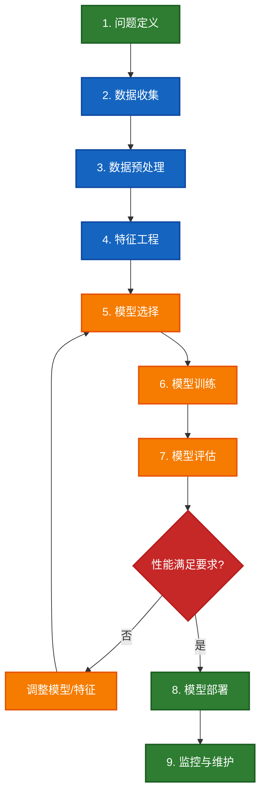

# 机器学习完整讲解

## 目录
- [一、机器学习的定义](#一机器学习的定义)
- [二、机器学习的核心内容](#二机器学习的核心内容)
- [三、机器学习的作用](#三机器学习的作用)
- [四、机器学习的应用场景](#四机器学习的应用场景)
- [五、机器学习的未来展望](#五机器学习的未来展望)

---

## 一、机器学习的定义

### 1.1 经典定义

#### Arthur Samuel（1959年）
> "机器学习是一个研究领域，它赋予计算机无需明确编程即可学习的能力。"

**解释**：不需要为每个任务编写详细规则，计算机可以从数据中自动学习。

#### Tom Mitchell（1997年）
> "对于某类任务T和性能度量P，如果一个计算机程序在T上以P衡量的性能随着经验E而自我完善，那么我们称这个计算机程序从经验E中学习。"

**数学表达**：
- **T（Task）**：任务，如垃圾邮件识别
- **P（Performance）**：性能指标，如识别准确率
- **E（Experience）**：经验数据，如历史邮件样本

**示例理解**：
```
任务T：识别垃圾邮件
性能P：准确率从70%提升到95%
经验E：通过学习10万封标注邮件

结论：程序从邮件数据中学习到了垃圾邮件的特征
```

### 1.2 通俗理解

#### 与人类学习的类比

| 人类学习 | 机器学习 |
|---------|---------|
| 小孩看到很多猫的图片 | 模型训练时看到很多猫的图片 |
| 家长告诉他"这是猫" | 标签标注"这是猫" |
| 孩子记住猫的特征（四条腿、胡须、喵喵叫） | 模型学习猫的特征（像素模式、形状） |
| 孩子见到新的猫也能认出来 | 模型对新图片也能识别是否为猫 |

#### 核心思想
**让计算机从数据中学习规律，而不是人工编写规则**

```python
# 传统编程方式（规则驱动）
def is_spam(email):
    if "中奖" in email:
        return True
    if "免费" in email:
        return True
    if "点击链接" in email:
        return True
    # 需要穷举所有可能的规则...
    return False

# 机器学习方式（数据驱动）
model.fit(email_data, labels)  # 从数据中自动学习规则
prediction = model.predict(new_email)  # 自动判断
```

### 1.3 机器学习与相关概念

#### 机器学习 vs 人工智能 vs 深度学习

```
人工智能（AI）
    └── 机器学习（ML）
            └── 深度学习（DL）
                    └── 大语言模型（LLM）
```

**关系说明**：
- **人工智能（AI）**：最广泛的概念，目标是让机器表现出智能行为
- **机器学习（ML）**：AI的一个子领域，通过数据学习实现AI
- **深度学习（DL）**：ML的一个分支，使用深层神经网络
- **大语言模型（LLM）**：DL的应用，专注于自然语言处理

**形象比喻**：
- AI = 让机器变聪明（目标）
- ML = 让机器从数据中学习（方法）
- DL = 用深层神经网络学习（具体技术）

---

## 二、机器学习的核心内容

### 2.1 机器学习的三要素

#### 1. 数据（Data）
**定义**：机器学习的"原材料"

**数据类型**：
- **结构化数据**：表格形式（如Excel）
  ```
  用户ID | 年龄 | 收入 | 是否购买
  001   | 25  | 5000 | 是
  002   | 45  | 8000 | 否
  ```

- **非结构化数据**：文本、图像、音频、视频
  ```
  文本："这个产品很好用"
  图像：一张猫的照片
  音频：一段语音录音
  ```

**数据质量要求**：
- ✅ **足够的数量**：通常越多越好
- ✅ **高质量**：准确、完整、无噪声
- ✅ **代表性**：覆盖各种情况
- ✅ **标注正确**（监督学习）

#### 2. 模型（Model）
**定义**：从输入到输出的数学映射函数

**模型类型**：
```
线性模型：
y = w₁x₁ + w₂x₂ + ... + b

决策树：
if 年龄 > 30:
    if 收入 > 5000:
        预测：会购买
    else:
        预测：不购买

神经网络：
输入层 → 隐藏层1 → 隐藏层2 → ... → 输出层
```

**模型能力**：
- **表达能力**：能学习多复杂的规律
- **泛化能力**：在新数据上的表现
- **计算效率**：训练和推理的速度

#### 3. 算法（Algorithm）
**定义**：训练模型的方法

**核心算法**：
```
梯度下降：
1. 初始化模型参数
2. 计算预测值与真实值的误差
3. 根据误差调整参数
4. 重复步骤2-3，直到误差足够小

伪代码：
for epoch in range(训练轮数):
    预测值 = model(输入数据)
    损失 = 计算损失(预测值, 真实值)
    梯度 = 计算梯度(损失)
    参数 = 参数 - 学习率 × 梯度
```

### 2.2 机器学习的三大范式

#### 1. 监督学习（Supervised Learning）

**特点**：训练数据有标签

**数学表示**：
```
训练集：D = {(x₁, y₁), (x₂, y₂), ..., (xₙ, yₙ)}
目标：学习函数 f，使得 f(x) ≈ y
```

**主要任务**：

##### 分类（Classification）
```python
# 二分类示例
输入：邮件内容
输出：是垃圾邮件 or 不是垃圾邮件

# 多分类示例
输入：新闻文章
输出：政治 / 体育 / 娱乐 / 科技
```

**常用算法**：
- 逻辑回归（Logistic Regression）
- 支持向量机（SVM）
- 决策树（Decision Tree）
- 随机森林（Random Forest）
- 神经网络（Neural Networks）

##### 回归（Regression）
```python
# 房价预测
输入：面积=100㎡, 地段=市中心, 房龄=5年
输出：预测价格=500万

# 股票预测
输入：历史价格、成交量、新闻情绪
输出：明天的股价=125.3元
```

**常用算法**：
- 线性回归（Linear Regression）
- 多项式回归（Polynomial Regression）
- 岭回归（Ridge Regression）
- 神经网络（Neural Networks）

**应用场景**：
- ✅ 垃圾邮件过滤
- ✅ 图像识别（猫狗分类）
- ✅ 语音识别
- ✅ 疾病诊断
- ✅ 房价预测
- ✅ 信用评分

#### 2. 无监督学习（Unsupervised Learning）

**特点**：训练数据无标签

**数学表示**：
```
训练集：D = {x₁, x₂, ..., xₙ}
目标：发现数据的内在结构或模式
```

**主要任务**：

##### 聚类（Clustering）
```python
# 用户分群
输入：用户行为数据（无标签）
输出：
  - 簇1：高消费用户
  - 簇2：价格敏感用户
  - 簇3：偶尔购买用户

# 文档聚类
输入：大量新闻文章（无标签）
输出：自动分为政治、体育、娱乐等类别
```

**常用算法**：
- K-Means
- 层次聚类（Hierarchical Clustering）
- DBSCAN
- 高斯混合模型（GMM）

##### 降维（Dimensionality Reduction）
```python
# 数据可视化
输入：1000维的用户特征向量
输出：降到2维，可以在平面上画出来

# 特征提取
输入：高维图像数据
输出：提取主要特征，去除冗余信息
```

**常用算法**：
- PCA（主成分分析）
- t-SNE
- UMAP
- 自编码器（Autoencoder）

##### 异常检测（Anomaly Detection）
```python
# 信用卡欺诈检测
输入：交易记录
输出：识别异常交易模式

# 设备故障预警
输入：传感器数据
输出：检测异常运行状态
```

**应用场景**：
- ✅ 用户画像与分群
- ✅ 推荐系统（协同过滤）
- ✅ 异常检测
- ✅ 数据压缩
- ✅ 主题发现

#### 3. 强化学习（Reinforcement Learning）

**特点**：通过与环境交互，试错学习最优策略

**核心概念**：
```
Agent（智能体）
    ↓ 执行动作
Environment（环境）
    ↓ 返回奖励和新状态
Agent根据奖励调整策略
```

**数学表示**：
```
Agent在状态s下采取动作a
获得奖励r，进入新状态s'
目标：最大化累积奖励 Σ r
```

**经典问题**：

##### 游戏AI
```python
# AlphaGo下围棋
状态：当前棋盘局面
动作：在哪个位置落子
奖励：赢棋得+1，输棋得-1
目标：学习最优下棋策略

# 游戏打怪
状态：角色位置、血量、怪物位置
动作：前进、后退、攻击、防御
奖励：打败怪物+10，受伤-5
目标：学习最优战斗策略
```

##### 机器人控制
```python
# 机器人走路
状态：关节角度、速度、位置
动作：调整各关节力矩
奖励：前进得分，摔倒扣分
目标：学习稳定行走

# 自动驾驶
状态：道路情况、车辆位置、速度
动作：加速、刹车、转向
奖励：安全行驶得分，违规扣分
目标：学习安全驾驶策略
```

**常用算法**：
- Q-Learning
- Deep Q-Network (DQN)
- Policy Gradient
- Actor-Critic
- PPO（Proximal Policy Optimization）

**应用场景**：
- ✅ 游戏AI（AlphaGo、Dota2、星际争霸）
- ✅ 机器人控制
- ✅ 自动驾驶
- ✅ 推荐系统优化
- ✅ 资源调度
- ✅ LLM对齐（RLHF）

### 2.3 机器学习的工作流程

#### 完整流程图



#### 各步骤详解

##### 1. 问题定义
```
明确目标：
- 要解决什么问题？
- 这是分类、回归还是聚类问题？
- 成功的标准是什么？

示例：
问题：预测客户是否会流失
类型：二分类问题
目标：准确率达到85%以上
```

##### 2. 数据收集
```
数据来源：
- 内部数据库
- 公开数据集
- 爬虫采集
- 传感器数据
- 用户生成内容

示例：收集客户的历史行为数据
- 购买记录
- 浏览历史
- 客服沟通记录
- 账户信息
```

##### 3. 数据预处理
```python
# 处理缺失值
df.fillna(df.mean())  # 用均值填充

# 处理异常值
df = df[df['age'] < 120]  # 移除异常年龄

# 数据标准化
from sklearn.preprocessing import StandardScaler
scaler = StandardScaler()
X_scaled = scaler.fit_transform(X)

# 类别编码
df['gender'] = df['gender'].map({'男': 0, '女': 1})
```

##### 4. 特征工程
```python
# 特征提取
df['购买频率'] = df['购买次数'] / df['注册天数']
df['客单价'] = df['总消费金额'] / df['购买次数']

# 特征选择
from sklearn.feature_selection import SelectKBest
selector = SelectKBest(k=10)
X_selected = selector.fit_transform(X, y)

# 特征组合
df['BMI'] = df['体重'] / (df['身高'] ** 2)
```

##### 5. 模型选择
```python
# 根据问题类型选择模型
分类问题：
- 逻辑回归、SVM、随机森林、XGBoost、神经网络

回归问题：
- 线性回归、决策树回归、神经网络

# 考虑因素：
- 数据量大小
- 特征维度
- 可解释性要求
- 计算资源
```

##### 6. 模型训练
```python
from sklearn.ensemble import RandomForestClassifier

# 划分训练集和测试集
from sklearn.model_selection import train_test_split
X_train, X_test, y_train, y_test = train_test_split(
    X, y, test_size=0.2, random_state=42
)

# 训练模型
model = RandomForestClassifier(n_estimators=100)
model.fit(X_train, y_train)
```

##### 7. 模型评估
```python
# 分类问题评估指标
from sklearn.metrics import accuracy_score, precision_score, recall_score, f1_score

y_pred = model.predict(X_test)

准确率 = accuracy_score(y_test, y_pred)
精确率 = precision_score(y_test, y_pred)
召回率 = recall_score(y_test, y_pred)
F1分数 = f1_score(y_test, y_pred)

# 回归问题评估指标
from sklearn.metrics import mean_squared_error, r2_score

MSE = mean_squared_error(y_test, y_pred)
R² = r2_score(y_test, y_pred)
```

##### 8. 模型部署
```python
# 保存模型
import joblib
joblib.dump(model, 'model.pkl')

# 部署为API服务
from flask import Flask, request, jsonify

app = Flask(__name__)
model = joblib.load('model.pkl')

@app.route('/predict', methods=['POST'])
def predict():
    data = request.json
    prediction = model.predict([data])
    return jsonify({'prediction': int(prediction[0])})
```

##### 9. 监控与维护
```python
# 监控指标
- 模型准确率是否下降
- 预测延迟是否增加
- 数据分布是否变化

# 模型更新
- 定期用新数据重新训练
- A/B测试新模型
- 版本管理
```

### 2.4 核心概念

#### 1. 过拟合与欠拟合

##### 欠拟合（Underfitting）
```
定义：模型过于简单，无法捕捉数据规律

表现：
- 训练集准确率低
- 测试集准确率低

原因：
- 模型太简单
- 特征太少
- 训练不充分

解决方法：
✅ 使用更复杂的模型
✅ 增加特征
✅ 增加训练时间
```

##### 过拟合（Overfitting）
```
定义：模型过于复杂，记住了训练数据的噪声

表现：
- 训练集准确率很高（接近100%）
- 测试集准确率低

原因：
- 模型太复杂
- 训练数据太少
- 训练时间太长

解决方法：
✅ 增加训练数据
✅ 正则化（L1、L2）
✅ Dropout
✅ 早停（Early Stopping）
✅ 数据增强
```

##### 形象比喻
```
考试类比：

欠拟合 = 学生没学会知识点
- 练习题做不对
- 考试题也做不对

恰当拟合 = 学生掌握了知识点
- 练习题大部分对
- 考试题也能做对

过拟合 = 学生死记硬背答案
- 练习题全对（背答案）
- 考试题不会（题目变了）
```

#### 2. 偏差与方差

```
偏差（Bias）：
- 模型预测值与真实值的偏离程度
- 高偏差 → 欠拟合

方差（Variance）：
- 模型对训练数据的敏感程度
- 高方差 → 过拟合

权衡（Bias-Variance Tradeoff）：
- 简单模型：高偏差、低方差
- 复杂模型：低偏差、高方差
- 目标：找到平衡点
```

#### 3. 交叉验证

```python
# K折交叉验证
from sklearn.model_selection import cross_val_score

# 将数据分为5份
# 每次用4份训练，1份验证
# 重复5次，取平均
scores = cross_val_score(model, X, y, cv=5)
平均准确率 = scores.mean()

目的：
✅ 更可靠的性能评估
✅ 充分利用数据
✅ 减少偶然性
```

---

## 三、机器学习的作用

### 3.1 技术层面的作用

#### 1. 自动化模式识别
```
替代人工规则：
传统方式：人工总结规则（耗时、不完整）
机器学习：自动从数据中学习规律

示例：
- 图像识别：自动识别猫狗、人脸
- 语音识别：自动将语音转文字
- 文本分类：自动分类新闻、邮件
```

#### 2. 处理高维复杂数据
```
能力：
- 处理成千上万个特征
- 发现非线性关系
- 处理多模态数据

示例：
输入：一张图片（224×224×3 = 150,528个像素值）
输出：图片中的物体类别

人类：难以描述识别规则
机器学习：自动学习特征和分类规则
```

#### 3. 自适应与持续学习
```
优势：
- 随着数据增加，性能提升
- 适应数据分布变化
- 无需重新编程

示例：推荐系统
- 持续收集用户行为数据
- 实时更新推荐模型
- 推荐越来越精准
```

#### 4. 大规模数据处理
```
能力：
- 处理TB级、PB级数据
- 分布式训练
- 实时预测

示例：
- Google搜索：处理数十亿网页
- 淘宝推荐：数亿用户、千万商品
- 自动驾驶：实时处理多传感器数据
```

### 3.2 商业层面的作用

#### 1. 降低成本
```
人工成本：
传统：需要大量人工处理
机器学习：自动化处理

示例：
客服机器人
- 传统：100个客服人员
- AI：10个人员 + 智能客服系统
- 节省：人力成本降低70%

文档审核
- 传统：人工审核每天处理1000份
- AI：自动审核每天处理10万份
- 效率：提升100倍
```

#### 2. 提升收入
```
精准营销：
- 传统：广撒网式营销，转化率2%
- ML：精准推荐，转化率10%
- 提升：收入增加5倍

个性化推荐：
- 电商：推荐用户可能购买的商品
- 视频：推荐用户喜欢的内容
- 效果：用户停留时间增加、购买增加
```

#### 3. 优化决策
```
数据驱动决策：
- 替代主观判断
- 量化分析
- 预测未来趋势

示例：
库存管理
- 预测商品需求量
- 优化库存水平
- 减少积压和缺货

风险控制
- 信贷审批：预测违约风险
- 保险定价：评估风险等级
- 欺诈检测：识别异常交易
```

#### 4. 创造新商业模式
```
AI驱动的新业务：
- 智能推荐系统（抖音、淘宝）
- 自动驾驶（特斯拉、Waymo）
- 智能助手（Siri、Alexa）
- AI绘画（Midjourney、Stable Diffusion）
- AI写作（ChatGPT、Jasper）
```

### 3.3 社会层面的作用

#### 1. 医疗健康
```
疾病诊断：
- AI辅助医生诊断癌症
- 准确率接近或超过人类专家
- 早期发现，提高治愈率

药物研发：
- 预测分子结构
- 加速新药开发
- 降低研发成本

个性化治疗：
- 基于基因数据的精准医疗
- 定制化治疗方案
```

#### 2. 教育
```
个性化学习：
- 根据学生水平定制学习路径
- 智能题库推荐
- 自适应学习系统

智能辅导：
- 作业批改
- 疑难解答
- 学习效果评估

教育公平：
- 优质教育资源普及
- 偏远地区获得AI教师辅助
```

#### 3. 环境保护
```
气候预测：
- 天气预报更准确
- 灾害预警
- 气候变化建模

能源优化：
- 智能电网
- 可再生能源调度
- 节能减排

生态监测：
- 野生动物追踪
- 森林火灾预警
- 海洋污染监测
```

#### 4. 交通运输
```
智能交通：
- 交通流量预测
- 信号灯优化
- 拥堵缓解

自动驾驶：
- 减少交通事故
- 提升运输效率
- 解放驾驶员

物流优化：
- 路线规划
- 配送调度
- 降低物流成本
```

#### 5. 公共安全
```
犯罪预防：
- 犯罪热点预测
- 智能监控
- 可疑行为识别

灾害预警：
- 地震预测
- 洪水预警
- 火灾检测

网络安全：
- 入侵检测
- 恶意软件识别
- 钓鱼网站识别
```

### 3.4 个人层面的作用

#### 1. 提升效率
```
日常工具：
- 智能输入法（预测文字）
- 语音助手（Siri、小爱同学）
- 邮件分类（自动过滤垃圾邮件）
- 照片管理（自动分类、搜索）

工作辅助：
- 代码补全（GitHub Copilot）
- 文档翻译
- 会议纪要自动生成
- PPT自动生成
```

#### 2. 增强能力
```
学习助手：
- ChatGPT：解答疑问
- 语言学习：实时翻译、口语练习
- 技能学习：个性化课程推荐

创作辅助：
- AI绘画：快速生成设计稿
- AI写作：文章润色、创意激发
- 音乐生成：辅助作曲
```

#### 3. 改善生活
```
健康管理：
- 运动监测
- 睡眠分析
- 饮食建议
- 健康风险评估

娱乐推荐：
- 视频推荐（抖音、YouTube）
- 音乐推荐（网易云、Spotify）
- 图书推荐
- 游戏推荐
```

---

## 四、机器学习的应用场景

### 4.1 计算机视觉（Computer Vision）

#### 1. 图像分类
```
应用场景：
📷 照片管理
- 自动识别照片中的人物、场景、物体
- Google Photos、iPhone照片

🏥 医疗影像
- X光片、CT扫描自动诊断
- 识别肿瘤、骨折等

🏭 工业检测
- 产品质量检测
- 缺陷识别
- 自动分拣

技术：CNN、ResNet、Vision Transformer
```

#### 2. 目标检测
```
应用场景：
🚗 自动驾驶
- 检测行人、车辆、交通标志
- 实时多目标追踪

📦 零售
- 无人超市商品识别
- 自动结账

🔍 安防监控
- 人脸识别
- 可疑行为检测
- 入侵告警

技术：YOLO、Faster R-CNN、SSD
```

#### 3. 图像分割
```
应用场景：
🏥 医学影像
- 肿瘤分割
- 器官分割
- 辅助手术规划

🚗 自动驾驶
- 道路分割
- 车道线检测
- 可行驶区域识别

📱 照片编辑
- 人像抠图
- 背景替换
- 美颜美体

技术：U-Net、Mask R-CNN、DeepLab
```

#### 4. 人脸识别
```
应用场景：
🔐 身份认证
- 手机解锁
- 门禁系统
- 支付验证

📸 照片整理
- 自动标注人物
- 相册分组

🏢 考勤打卡
- 人脸识别打卡
- 访客登记

⚠️ 隐私问题：需要合规使用

技术：FaceNet、ArcFace、DeepFace
```

#### 5. 图像生成
```
应用场景：
🎨 AI绘画
- Midjourney：文字生成图片
- Stable Diffusion：开源图像生成
- DALL-E：OpenAI的图像生成

🎬 视频制作
- 特效生成
- 虚拟角色
- 场景扩展

🏠 设计辅助
- 室内设计效果图
- 产品设计草图
- 建筑可视化

技术：GAN、Diffusion Model、VAE
```

### 4.2 自然语言处理（NLP）

#### 1. 文本分类
```
应用场景：
📧 垃圾邮件过滤
- Gmail自动分类垃圾邮件
- 准确率>99%

😊 情感分析
- 电商评论情感判断
- 社交媒体舆情监控
- 品牌声誉管理

📰 新闻分类
- 自动标注新闻类别
- 个性化新闻推荐

💬 客服分类
- 自动分配客服
- 问题优先级排序

技术：BERT、RoBERTa、TextCNN
```

#### 2. 命名实体识别（NER）
```
应用场景：
🔍 信息抽取
- 从新闻中提取人名、地名、机构名
- 构建知识图谱

📄 简历解析
- 提取姓名、学历、工作经历
- 自动填充表单

⚖️ 法律文书
- 识别案件当事人、法院、日期
- 辅助法律分析

技术：BERT-NER、BiLSTM-CRF、spaCy
```

#### 3. 机器翻译
```
应用场景：
🌍 在线翻译
- Google Translate
- DeepL翻译
- 百度翻译

📱 实时翻译
- 旅游翻译助手
- 视频字幕翻译
- 同声传译辅助

📚 文档翻译
- 论文翻译
- 合同翻译
- 多语言内容本地化

技术：Transformer、BERT、GPT
```

#### 4. 问答系统
```
应用场景：
🤖 智能客服
- 自动回答常见问题
- 24小时在线服务
- 降低人工成本

🔍 搜索引擎
- 直接回答问题，而非列出链接
- Google搜索、必应搜索

📖 知识库问答
- 企业内部知识库
- 医疗咨询
- 法律咨询

技术：BERT、GPT、RAG（检索增强生成）
```

#### 5. 文本生成
```
应用场景：
✍️ 内容创作
- 文章写作辅助
- 广告文案生成
- 产品描述自动生成

💬 对话系统
- ChatGPT
- 智能客服
- 虚拟助手

📝 文档生成
- 自动生成报告
- 邮件自动回复
- 代码注释生成

技术：GPT-3/4、ChatGPT、文心一言
```

#### 6. 文本摘要
```
应用场景：
📰 新闻摘要
- 自动生成新闻标题
- 长文章提取要点

📄 文档摘要
- 会议纪要生成
- 论文摘要提取
- 法律文书总结

💼 商业应用
- 财报摘要
- 市场分析报告简化

技术：BART、T5、Pegasus
```

### 4.3 语音处理

#### 1. 语音识别（ASR）
```
应用场景：
📱 语音助手
- Siri、小爱同学、天猫精灵
- 语音指令控制

⌨️ 语音输入
- 微信语音转文字
- 会议记录
- 字幕生成

♿ 无障碍应用
- 帮助听障人士
- 实时字幕

技术：Whisper、DeepSpeech、Wav2Vec
```

#### 2. 语音合成（TTS）
```
应用场景：
🔊 语音播报
- 导航语音
- 新闻播报
- 有声读物

📞 客服系统
- 自动语音应答
- 电话机器人

🎮 游戏娱乐
- 虚拟角色配音
- 游戏旁白

技术：Tacotron、FastSpeech、VITS
```

#### 3. 声纹识别
```
应用场景：
🔐 身份验证
- 声纹解锁
- 银行身份认证

🕵️ 刑侦取证
- 嫌疑人识别
- 录音溯源

技术：i-Vector、x-Vector、深度学习
```

### 4.4 推荐系统

#### 1. 电商推荐
```
应用场景：
🛒 淘宝/京东
- "猜你喜欢"
- "看了又看"
- "买了又买"

💰 效果：
- 提升GMV 10-30%
- 提升用户停留时间
- 增加购买频次

技术：协同过滤、深度学习、强化学习
```

#### 2. 内容推荐
```
应用场景：
📺 视频平台
- 抖音：短视频推荐
- YouTube：视频推荐
- B站：UP主推荐

🎵 音乐平台
- 网易云音乐：日推
- Spotify：个性化歌单

📰 新闻资讯
- 今日头条
- Google News

技术：点击率预估、序列模型、图神经网络
```

#### 3. 社交推荐
```
应用场景：
👥 好友推荐
- 微信"可能认识的人"
- LinkedIn联系人推荐

📱 内容分发
- 微博热搜
- 知乎推荐
- 小红书推荐

技术：社交网络分析、图嵌入
```

### 4.5 金融科技

#### 1. 风险控制
```
应用场景：
💳 信用评分
- 贷款审批
- 信用卡发放
- 风险定价

🚨 欺诈检测
- 信用卡盗刷检测
- 反洗钱
- 保险欺诈识别

技术：逻辑回归、XGBoost、神经网络
```

#### 2. 量化交易
```
应用场景：
📈 股票交易
- 高频交易
- 趋势预测
- 算法交易

💹 风险对冲
- 投资组合优化
- 衍生品定价

技术：时间序列分析、强化学习、深度学习
```

#### 3. 智能投顾
```
应用场景：
🤖 理财顾问
- 个性化投资建议
- 资产配置
- 风险评估

📊 基金推荐
- 根据风险偏好推荐基金
- 定投计划

技术：推荐系统、风险建模
```

### 4.6 医疗健康

#### 1. 疾病诊断
```
应用场景：
🔬 医学影像诊断
- 肺结节检测（准确率>95%）
- 皮肤癌识别
- 眼底病变检测

🩺 辅助诊断
- 症状分析
- 疾病预测
- 用药建议

技术：CNN、ResNet、U-Net
```

#### 2. 药物研发
```
应用场景：
💊 新药发现
- 分子结构预测
- 药物筛选
- 加速研发周期

🧬 基因分析
- 基因测序
- 疾病基因关联
- 个性化医疗

技术：图神经网络、强化学习、AlphaFold
```

#### 3. 健康管理
```
应用场景：
⌚ 可穿戴设备
- 心率监测
- 睡眠分析
- 运动追踪

📱 健康APP
- 饮食建议
- 健身计划
- 疾病风险评估

技术：时间序列分析、异常检测
```

### 4.7 自动驾驶

#### 1. 感知系统
```
应用场景：
👁️ 环境感知
- 车道线检测
- 交通标志识别
- 行人检测
- 车辆检测

📷 多传感器融合
- 摄像头
- 激光雷达
- 毫米波雷达

技术：目标检测、语义分割、3D视觉
```

#### 2. 决策规划
```
应用场景：
🗺️ 路径规划
- 全局路径规划
- 局部路径规划
- 避障策略

🚦 行为决策
- 变道决策
- 超车决策
- 红绿灯响应

技术：强化学习、决策树、深度学习
```

#### 3. 控制系统
```
应用场景：
🎮 车辆控制
- 转向控制
- 速度控制
- 刹车控制

技术：端到端学习、模型预测控制
```

### 4.8 智能制造

#### 1. 质量检测
```
应用场景：
🔍 缺陷检测
- 产品表面缺陷
- 电路板检测
- 零件尺寸测量

📊 质量预测
- 预测产品良率
- 工艺优化

技术：计算机视觉、异常检测
```

#### 2. 预测性维护
```
应用场景：
⚙️ 设备维护
- 预测设备故障
- 提前安排维护
- 减少停机时间

💰 效益：
- 降低维护成本30%
- 提升设备使用率20%

技术：时间序列、异常检测
```

#### 3. 供应链优化
```
应用场景：
📦 需求预测
- 销量预测
- 库存优化
- 补货计划

🚚 物流优化
- 路线规划
- 配送调度
- 仓储管理

技术：回归分析、优化算法
```

### 4.9 教育科技

#### 1. 智能辅导
```
应用场景：
📚 个性化学习
- 根据学生水平推荐题目
- 自适应学习路径
- 知识点掌握评估

✍️ 作业批改
- 自动批改选择题、填空题
- 作文评分
- 错题分析

技术：知识追踪、NLP、推荐系统
```

#### 2. 在线教育
```
应用场景：
💻 在线课程
- 课程推荐
- 学习效果预测
- 辍学预警

🎓 智能答疑
- AI老师
- 24小时在线答疑
- 多轮对话

技术：LLM、对话系统、推荐系统
```

### 4.10 农业

#### 1. 精准农业
```
应用场景：
🌾 作物监测
- 无人机巡田
- 病虫害识别
- 作物长势评估

💧 智能灌溉
- 土壤湿度监测
- 精准灌溉
- 节水30-50%

技术：计算机视觉、传感器数据分析
```

#### 2. 产量预测
```
应用场景：
📈 收成预测
- 预测农作物产量
- 指导种植决策
- 市场价格预测

技术：回归分析、时间序列
```

---

## 五、机器学习的未来展望

### 5.1 技术发展趋势

#### 1. 大模型时代
```
趋势：
- 参数规模持续增长（GPT-4: 1.76万亿参数）
- 多模态融合（文本+图像+音频+视频）
- 通用人工智能（AGI）方向发展

影响：
✅ 单一模型处理多种任务
✅ Few-shot学习能力增强
✅ 推理能力提升
```

#### 2. 小型化与边缘计算
```
趋势：
- 模型压缩技术
- 端侧AI（手机、IoT设备）
- 隐私保护

应用：
- 手机上运行AI模型
- 智能家居设备
- 可穿戴设备
```

#### 3. AutoML自动机器学习
```
趋势：
- 自动化模型选择
- 自动化特征工程
- 自动化超参数调优

影响：
- 降低AI门槛
- 非专家也能使用
- 加速AI应用落地
```

#### 4. 可解释AI
```
趋势：
- 模型决策可解释
- 透明度提升
- 可信AI

应用：
- 医疗诊断（需要解释依据）
- 金融审批（合规要求）
- 司法判决（公平性）
```

#### 5. 联邦学习
```
趋势：
- 分布式训练
- 数据不出本地
- 隐私保护

应用：
- 医疗数据共享（不泄露隐私）
- 金融风控（多机构协作）
- 跨企业AI协作
```

### 5.2 应用场景展望

#### 1. 个人AI助手
```
未来：
- 每个人都有专属AI助手
- 全面了解个人习惯和偏好
- 主动提供帮助

能力：
- 日程管理
- 信息筛选
- 决策建议
- 学习辅助
- 健康管理
```

#### 2. 科学研究加速
```
未来：
- AI辅助科学发现
- 加速实验设计
- 自动化文献综述

领域：
- 药物研发：从10年缩短到2-3年
- 材料科学：新材料发现
- 基础物理：辅助理论验证
```

#### 3. 创意产业变革
```
未来：
- AI辅助创作成为常态
- 降低创作门槛
- 激发创意灵感

应用：
- 影视制作
- 游戏开发
- 广告创意
- 音乐创作
```

#### 4. 智慧城市
```
未来：
- 城市全面数字化
- AI驱动城市管理
- 提升生活质量

应用：
- 智能交通（减少拥堵50%）
- 智能能源（节能30%）
- 智慧医疗（提升效率）
- 公共安全（犯罪预防）
```

### 5.3 挑战与问题

#### 1. 数据隐私
```
问题：
- 训练数据可能包含敏感信息
- 模型可能泄露训练数据
- 用户隐私保护

解决方向：
- 差分隐私
- 联邦学习
- 同态加密
```

#### 2. 算法偏见
```
问题：
- 训练数据存在偏见
- 模型决策不公平
- 歧视性输出

解决方向：
- 公平性约束
- 数据去偏
- 多样性保证
```

#### 3. 可解释性
```
问题：
- 深度学习是"黑盒"
- 难以解释决策依据
- 信任度问题

解决方向：
- 注意力可视化
- SHAP、LIME等解释方法
- 可解释模型架构
```

#### 4. 安全性
```
问题：
- 对抗样本攻击
- 模型后门
- 恶意使用

解决方向：
- 鲁棒性训练
- 安全审计
- 伦理规范
```

#### 5. 能源消耗
```
问题：
- 大模型训练耗能巨大
- GPT-3训练消耗电力相当于126个家庭一年用电
- 环境影响

解决方向：
- 高效训练算法
- 模型压缩
- 绿色AI
```

### 5.4 学习建议

#### 1. 理论基础
```
必备知识：
✅ 数学基础（线性代数、概率论、微积分）
✅ 编程能力（Python、NumPy、Pandas）
✅ 机器学习理论
✅ 深度学习基础
```

#### 2. 实践能力
```
动手项目：
✅ 参加Kaggle竞赛
✅ 复现经典论文
✅ 开源项目贡献
✅ 实际问题解决
```

#### 3. 持续学习
```
资源推荐：
📚 书籍：
- 《机器学习》周志华
- 《深度学习》Ian Goodfellow
- 《统计学习方法》李航

🎓 课程：
- Andrew Ng机器学习课程
- CS229 斯坦福机器学习
- Fast.ai深度学习课程

📝 论文：
- arXiv最新论文
- 顶会论文（NeurIPS、ICML、ICLR）
```

#### 4. 关注前沿
```
信息来源：
- Hugging Face：模型和数据集
- Papers with Code：论文+代码
- GitHub：开源项目
- Twitter/X：研究者动态
```

---

## 总结

### 机器学习的本质
> **让计算机从数据中自动学习规律，在未知情况下做出智能决策。**

### 核心价值
1. ✅ **自动化**：替代人工编写规则
2. ✅ **规模化**：处理海量数据
3. ✅ **智能化**：发现隐藏规律
4. ✅ **个性化**：千人千面服务
5. ✅ **持续优化**：随数据增加而改进

### 应用前景
- 🚀 **无处不在**：渗透到生活的方方面面
- 🌟 **改变世界**：提升生产力、改善生活
- 🔮 **未来可期**：通向通用人工智能（AGI）

### 责任与伦理
- ⚖️ 技术中立，但应用需负责任
- 🛡️ 保护隐私、确保公平、安全可控
- 🌍  让AI造福全人类

---

**机器学习不是万能的，但它正在改变世界！** 🌟
